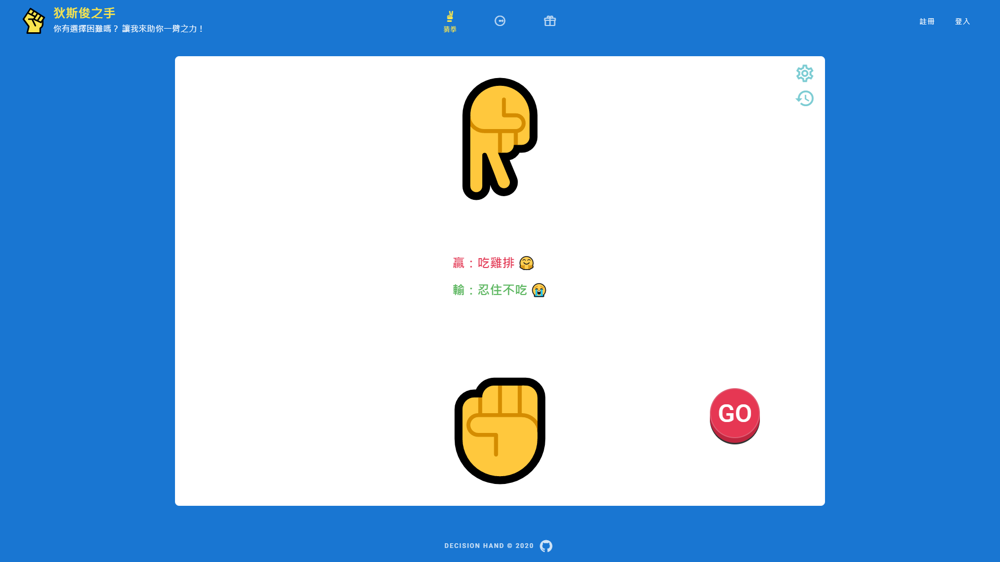
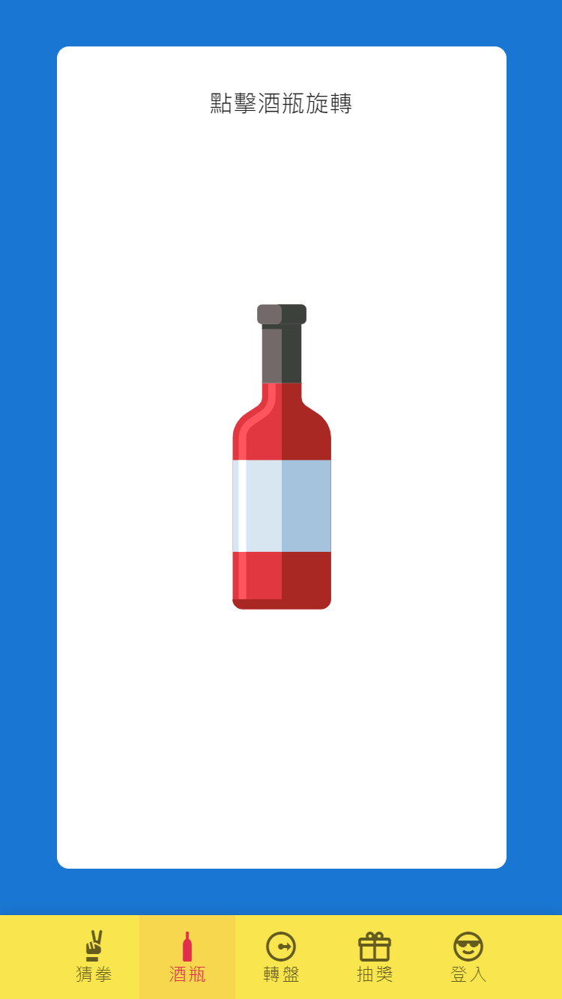
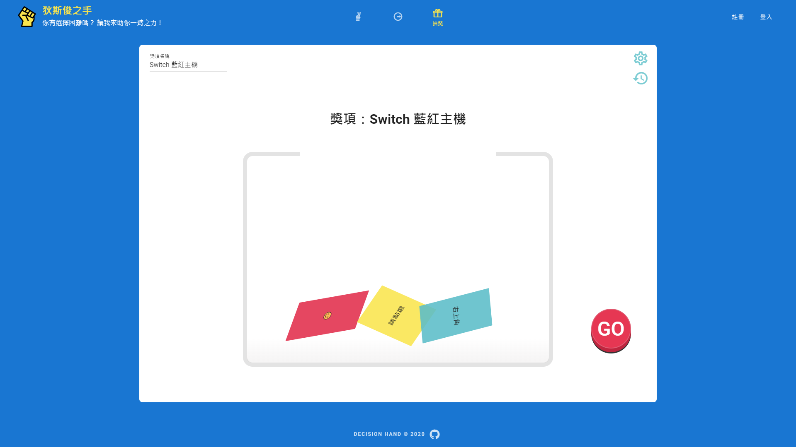

# 狄斯俊之手 Decision Hand
### 網頁：https://ya95123.github.io/vue-decisionHand/#/
### 說明：這是一款協助容易有選擇困難症的人來使用，加速做決定的過程，並帶入趣味性、加入抽獎功能的網頁。
### 功能
  * 猜拳：提供二選一的方式協助做決定。
  
  * 酒瓶：這是寬度 1024 (平板)以下才有的功能，用來作轉方向的工具，例如：玩真心話大冒險時。
  
  * 轉盤：提供多擇一的功能( 上限為 12項)。
  
  * 抽獎：抽獎紙條並無上限，中途皆可替換獎項名稱。
  

### 直接開始試試看吧！
https://ya95123.github.io/vue-decisionHand/#/

### 未來版本升級
  * 優化版面
  * 增加說明頁
  * 增加儲存資料功能
  * 增加匯入資料功能
  * 增加歷史紀錄功能
  * 與後臺 API 串接
